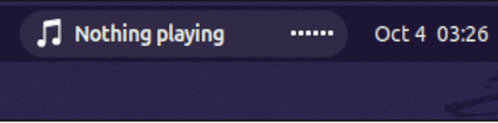
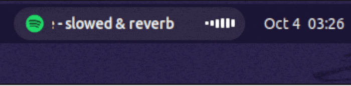
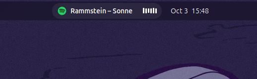
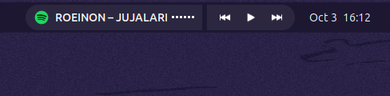
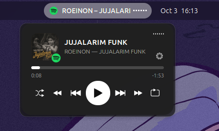
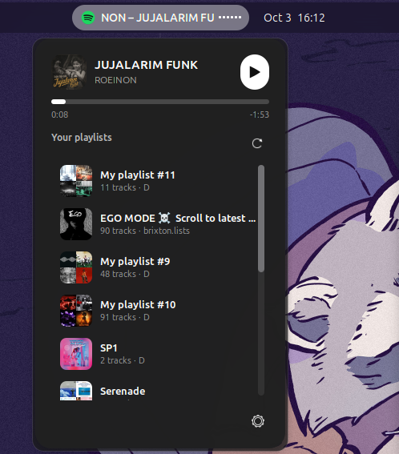
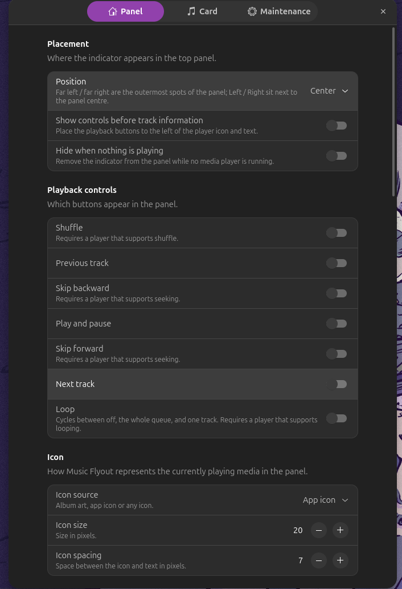

<h1 align="center">Music Flyout</h1>

<p align="center">
  A Fluent-style <b>now-playing pill</b> and <b>flyout card</b> for the GNOME top panel.<br>
  Controls any MPRIS player, shows album art, a real audio visualizer, scroll-wheel controls and (for Spotify) your playlists.
</p>

<p align="center">
  <a href="https://github.com/partialHuman/music-flyout/releases"></a>
  
  <a href="LICENSE"></a>
  
  
  
</p>

<p align="center">
  <a href="https://github.com/partialHuman/music-flyout/stargazers"></a>
  <a href="https://github.com/partialHuman/music-flyout/issues"></a>
  <a href="https://github.com/partialHuman/music-flyout/commits/main"></a>
  <a href="https://github.com/partialHuman/music-flyout/pulls"></a>
</p>

<!-- After the extensions.gnome.org listing is approved, add this badge (replace <ID> with your extension's number):
<p align="center"><a href="https://extensions.gnome.org/extension/<ID>/music-flyout/"></a></p>
-->

<p align="center">
  
  <br>
  <sub>Nothing playing → click play → Spotify starts and playback resumes.</sub>
</p>

<p align="center">
  
  <br>
  <sub>Scrolling title and the live visualizer.</sub>
</p>

---

## Contents

- [Features](#features)
- [Screenshots](#screenshots)
- [Requirements](#requirements)
- [Installation](#installation)
- [Using it](#using-it)
- [Settings](#settings)
- [Spotify playlists (optional)](#spotify-playlists-optional)
- [How it works](#how-it-works)
- [Privacy and files written](#privacy-and-files-written)
- [Troubleshooting](#troubleshooting)
- [Known limitations](#known-limitations)
- [Development](#development)
- [Credits and disclaimer](#credits-and-disclaimer)
- [License](#license)

## Features

**Panel pill**
- Shows the current track with an icon, title and artist, plus an optional visualizer.
- **Icon source:** app icon, album art, playing status, a custom image, or none. Icon size and spacing are adjustable.
- **Fixed-width text** with marquee scrolling (continuous or once per track, either direction, adjustable speed) or a plain ellipsis.
- **Visualizer** with 3–9 bars. It is driven by [`cava`](https://github.com/karlstav/cava) for real audio levels and falls back to animated bars if `cava` isn't installed.
- **Optional playback buttons** attached to the pill: shuffle, previous, skip backward, play/pause, skip forward, next, loop. Place them before or after the text.
- **Five positions:** far left, left, center, right, far right.
- Can hide itself when no player is running.

**Mouse, scroll and hover**
- **Click actions** for left / middle / right click (play/pause, open card, next, previous, nothing). Default: left = play/pause, right = open card.
- **Scroll wheel / touchpad** over the pill: change track, change volume (system master or the active player), switch player, or seek. A **secondary action** runs while you hold a modifier key (Ctrl, Alt, Shift, Super, or a combination).
- **Hover to open** the card, with adjustable open and close delays.
- Keyboard: Enter or Space on the focused pill opens the card.

**Flyout card — three styles**
- **Default:** large rounded album art, title, artist, seek bar, full controls.
- **Compact:** a small thumbnail with the player icon as a badge, a mini visualizer, and evenly spread controls.
- **Playlists:** a slim now-playing header plus a scrolling list of all your Spotify playlists; click one to play it.
- Acrylic-style translucent background with optional blur, rounded corners, click-to-seek progress bar with elapsed/remaining time, hover animations on buttons.
- **Multiple players:** a player switcher (icons beside the settings button), and an option to pause other players when a new one starts.
- Settings button right in the card.

**Starts your player for you**
- With nothing running, pressing *any* play/pause button (pill, card, or left click) opens a configurable app (Spotify by default) and keeps pressing Play until it starts. The pill shows "Starting Spotify…" while it waits. This can be switched off.

**Smart icons**
- Finds the right player icon for deb, snap and flatpak installs by searching desktop entries and icon-theme names, and falls back to a generic music icon.

**Maintenance**
- Shows the size of the album-art cache and can clear it; "Reset all settings" restores every default.

## Screenshots

**The pill**

| Default | With attached controls |
|---|---|
|  |  |

**The card**

| Default | Compact | Playlists |
|---|---|---|
|  |  |  |

<details>
<summary><b>Settings window</b> (click to expand)</summary>

| Panel — placement, controls, icon | Panel — text, scrolling, scroll wheel |
|---|---|
|  |  |

| Panel — mouse, hover, visualizer | Card |
|---|---|
|  |  |

| Card — Spotify playlists setup |
|---|
|  |

</details>

## Requirements

- **GNOME Shell 45–50** (declared in `metadata.json`). It has been developed and tested on the author's desktop; if something breaks on your version, please open an issue and include the output of `gnome-shell --version`.
- A media player that exposes **MPRIS** (Spotify, Firefox/Chrome, VLC, Rhythmbox, and most others).
- Optional: **[`cava`](https://github.com/karlstav/cava)** for the real audio visualizer (`sudo apt install cava`, `sudo dnf install cava`, `sudo pacman -S cava`).
- Optional: a Spotify account and a free developer app for the [Playlists card style](#spotify-playlists-optional).

## Installation

### From extensions.gnome.org

Once the listing is live, open the extension's page on [extensions.gnome.org](https://extensions.gnome.org) (or search "Music Flyout" in the *Browse* tab of Extension Manager) and switch it on.

### From a release zip

Download `music-flyout@partialHuman.zip` from the [Releases page](https://github.com/partialHuman/music-flyout/releases), then:

```bash
gnome-extensions install --force music-flyout@partialHuman.zip
```

Then **log out and back in** (Wayland can't reload shell code on the fly) and enable it:

```bash
gnome-extensions enable music-flyout@partialHuman
```

You can also enable it from the **Extension Manager** app.

### From source

```bash
git clone https://github.com/partialHuman/music-flyout.git \
  ~/.local/share/gnome-shell/extensions/music-flyout@partialHuman
glib-compile-schemas ~/.local/share/gnome-shell/extensions/music-flyout@partialHuman/schemas
```

Or, from a checkout of the repository: `make install`.

Log out and back in, then enable the extension as above.

> **The folder name must match the `uuid` in `metadata.json`** (`music-flyout@partialHuman`). If you change one, change the other.

### Opening the settings

- Click the **⚙ button in the card**, or
- run `gnome-extensions prefs music-flyout@partialHuman`, or
- use the settings button in Extension Manager.

## Using it

| Action | Default behaviour | Configurable in |
|---|---|---|
| Left click on the pill | Play / pause | Panel → Mouse buttons |
| Right click on the pill | Open the card | Panel → Mouse buttons |
| Middle click on the pill | Nothing | Panel → Mouse buttons |
| Scroll over the pill | Change system volume | Panel → Scroll wheel controls |
| Modifier + scroll | Secondary action (off until enabled) | Panel → Scroll wheel controls |
| Hover over the pill | Nothing (off by default) | Panel → Hover |
| Click the seek bar | Jump to that position | Card → Playback |
| Enter / Space on the focused pill | Open the card | — |

Notes:
- If the card was opened by hovering, **right-clicking pins it open**.
- The **Fn key can't be used** as a scroll modifier: it is handled inside the keyboard and never reaches the desktop. Some Super + scroll combinations may also be claimed by GNOME itself, so Ctrl or Alt are the safest choices.
- Seeking, shuffle and loop depend on what the player supports; unsupported buttons hide themselves.

## Settings

**Panel page**
- *Placement* — position, controls before or after the text, hide when nothing is playing.
- *Playback controls* — which buttons appear in the pill.
- *Icon* and *Custom image* — icon source, size, spacing, and an image picker.
- *Track information* — title, artist, reserved text width.
- *Scrolling text* — scroll or ellipsis, repeat, direction, speed.
- *Scroll wheel controls* — primary action, volume target (system master or active player), animation and direction inversion, secondary action and its modifier key.
- *Mouse buttons*, *When nothing is playing*, *Hover*, *Visualizer*.

**Card page**
- *Appearance* — card style, album art on/off and size, card width, blur.
- *Multiple players* — player switcher, one player at a time.
- *Playback* — seek bar, skip buttons and amount, shuffle and loop buttons.
- *Spotify playlists* — Client ID, login, list height.

**Maintenance page** — album-art cache and reset.

## Spotify playlists (optional)

The **Playlists** card style lists your Spotify playlists and plays one when you click it. Spotify's desktop app doesn't expose that list locally, so the extension reads it through Spotify's Web API. Since early 2026 Spotify only lets apps owned by a **Premium** account use that API, so you create your own free developer app (one time):

1. Open the [Spotify developer dashboard](https://developer.spotify.com/dashboard) and **create an app** (tick *Web API*).
2. In the app's settings, add this **Redirect URI** exactly:
   ```
   http://127.0.0.1:8898/callback
   ```
3. Copy the app's **Client ID** into *Settings → Card → Spotify playlists → Client ID*.
4. Press **Connect**. A browser tab opens; approve the request, then close the tab.
5. Set *Card style* to **Playlists** and open the card.

What it does and doesn't do:
- It only asks for permission to **read** your playlists (`playlist-read-private`, `playlist-read-collaborative`).
- Clicking a playlist tells the running Spotify desktop app to open it (via MPRIS `OpenUri`) and then presses Play if needed. If Spotify isn't running, it is started first.
- The playlist list is cached on disk, so the card opens instantly and refreshes in the background (at most every 5 minutes; the refresh button forces it).
- Press **Disconnect** at any time to delete the stored login.

## How it works

- **Players** are discovered over D-Bus (`org.mpris.MediaPlayer2.*`) and controlled through their MPRIS interfaces.
- **Visualizer:** while something is playing, the extension starts `cava` with a generated config that prints bar levels as text, and reads them line by line. It stops `cava` when playback pauses.
- **System volume** uses the shell's `Gvc` mixer library; player volume uses the MPRIS `Volume` property.
- **Album art** from `file://` URLs is used directly; `http(s)` art is downloaded with libsoup and cached.
- **Spotify login** uses the Authorization Code flow with **PKCE** (no client secret). During login the settings window runs a tiny web server on `127.0.0.1:8898` to receive the redirect, and shuts it down as soon as the login finishes.
- **Settings** live in GSettings; changing one rebuilds the indicator, so changes apply immediately.

## Privacy and files written

- No analytics or telemetry.
- Network access happens only for (a) album art URLs supplied by your players, and (b) the Spotify Web API **if you connect an account**.
- Files:

| Path | Contents |
|---|---|
| `~/.cache/music-flyout/art/` | Downloaded album art and playlist covers |
| `~/.cache/music-flyout/playlists.json` | Cached playlist names and cover links |
| `~/.cache/music-flyout/cava.conf` | Generated `cava` config |
| `~/.config/music-flyout/spotify.json` | Spotify refresh token (readable only by you) — delete it with *Disconnect* |

## Troubleshooting

Follow the extension's log while you reproduce a problem:

```bash
journalctl -f -o cat /usr/bin/gnome-shell | grep -i "music flyout"
```

| Problem | What to try |
|---|---|
| Extension shows an error after updating | Log out and back in; shell code and settings schemas are only reloaded in a new session. |
| Visualizer bars stay flat | Make sure `cava` is installed and works in a terminal. Try *cava input method → PipeWire*. |
| Visualizer is random, not real | `cava` isn't installed or exited; the fallback animation is used. |
| Blur looks odd at the corners | The blur area is rectangular. Turn off *Card → Blur background*. |
| Clicks on the pill do nothing | Open an issue with the output of `gnome-shell --version` and any errors from the log command above. |
| Wrong or generic player icon | Check the log; the extension searches desktop files for deb, snap and flatpak installs and falls back to a generic music icon. |
| Play doesn't start Spotify | Check *When nothing is playing*: the toggle must be on and the app name must match an installed app (`spotify` by default). |
| Playlists don't load | Make sure you're connected, the Client ID is correct, and the redirect URI is registered exactly as shown. "Invalid redirect URI" means a mismatch; "port in use" means something else is using 8898 during login. A 403 means the Spotify account isn't allowed to use that developer app. |

## Known limitations

- Player support varies. Seeking, shuffle, loop and volume work only if the player implements them.
- The Playlists style only works with the **Spotify desktop app**.
- Spotify's Web API access rules change; the setup above reflects the rules at the time of writing.
- The blur effect covers a rectangle, not the rounded card shape.
- Touchpad scroll sensitivity is fixed and may need tuning on some devices.
- The extension relies on GNOME Shell internals that change between releases.

## Development

```
music-flyout/
├── extension.js      # pill, card styles, MPRIS, visualizer, click / scroll / hover handling
├── prefs.js          # preferences window (Panel, Card, Maintenance) and Spotify login
├── spotify.js        # Spotify Web API + PKCE helpers (used by both of the above)
├── stylesheet.css
├── metadata.json
├── schemas/
│   └── org.gnome.shell.extensions.music-flyout.gschema.xml
├── screenshots/      # README images (not shipped in the extension zip)
├── Makefile          # make zip / install / uninstall
└── LICENSE
```

Build a zip (contains only the files the extension needs):

```bash
make zip        # -> music-flyout@partialHuman.zip
make install    # copy into ~/.local/share/gnome-shell/extensions and compile the schema
```

Try changes without logging out (nested shell):

```bash
dbus-run-session gnome-shell --devkit          # GNOME 49+
dbus-run-session gnome-shell --nested --wayland   # older versions
```

Tips:
- `schemas/gschemas.compiled` is generated; don't commit it.
- Keep `disable()` clean: every timer, signal, subprocess and actor created in `enable()` must be removed (a requirement of extensions.gnome.org review).
- The zip for extensions.gnome.org must not contain `schemas/gschemas.compiled`, the README, screenshots or build scripts; `make zip` already leaves them out.
- Only list GNOME versions in `shell-version` that you have actually tested.

## Credits and disclaimer

- Inspired by Fluent Flyout for Windows and by the settings of existing GNOME media-panel extensions such as Medialine.
- Visualizer powered by [cava](https://github.com/karlstav/cava).
- This project is **not affiliated with or endorsed by Spotify**. "Spotify" and its logo are trademarks of Spotify AB. The extension ships no Spotify artwork; the Spotify icon in the screenshots is your system's own app icon.

## License

Copyright © 2026 [partialHuman](https://github.com/partialHuman). Licensed under the **GNU General Public License v2.0 or later** (`GPL-2.0-or-later`) — see [LICENSE](LICENSE). This is the license family GNOME Shell itself uses, which extensions distributed on extensions.gnome.org must be compatible with.
