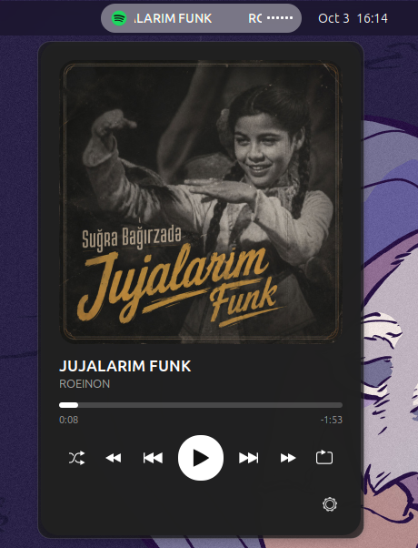
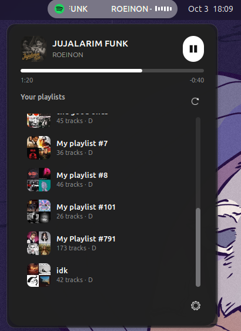
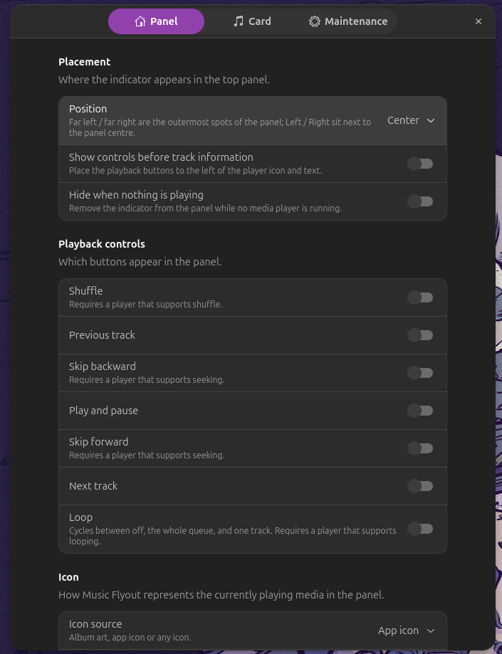
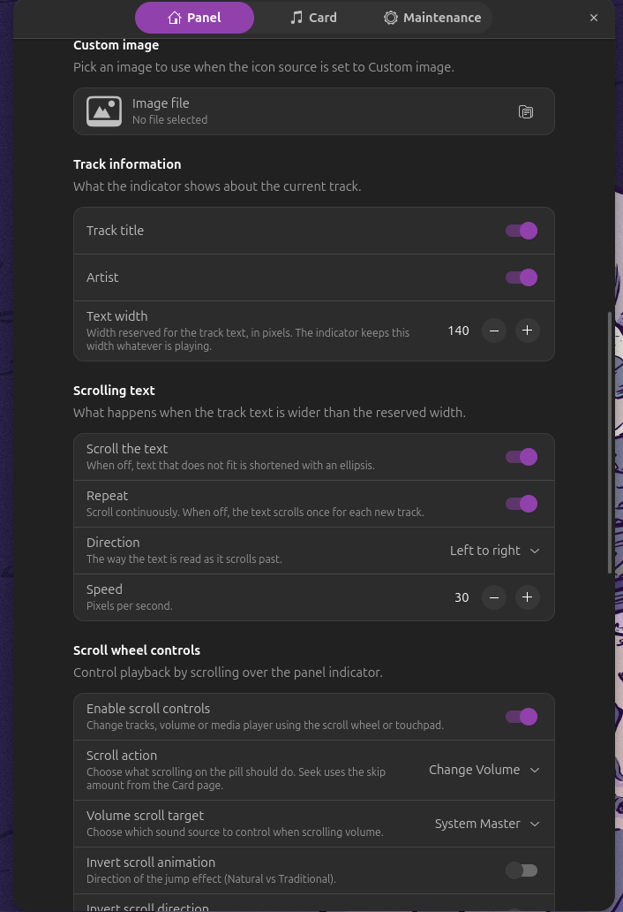
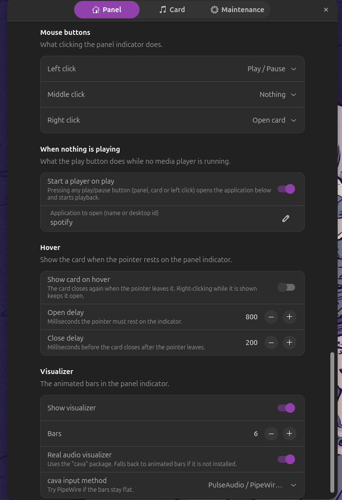
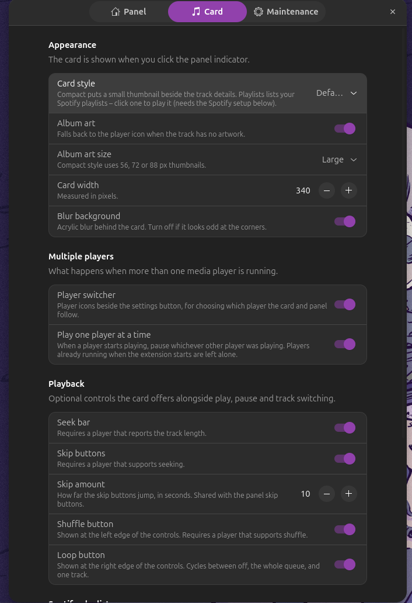
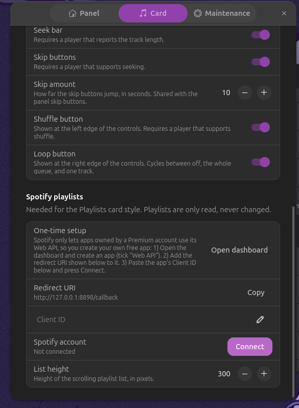

# Music Flyout

<p align="center">

[](https://github.com/partialHuman/music-flyout/blob/main/LICENSE)
[](https://github.com/partialHuman/music-flyout)
[](https://github.com/partialHuman/music-flyout/releases)
[](https://github.com/partialHuman/music-flyout/stargazers)
[](https://github.com/partialHuman/music-flyout/issues)
[](https://github.com/partialHuman/music-flyout)

</p>

A Fluent-style music controller and visualizer for **GNOME Shell**, designed for a compact top-panel experience with an acrylic media card, album artwork, playback controls, real audio visualization, player switching, and Spotify playlist browsing.

> **Current version: v14**

## ✨ Features

### 🎵 Top-panel music indicator
- Rounded pill-style panel indicator.
- Album art, application icon, track title and artist.
- Animated visualizer bars.
- Five configurable panel positions: **Far left, Left, Center, Right, Far right**.
- Optional playback controls in the panel.
- Mouse-button actions and scroll-wheel controls.
- Optional scrolling track text.
- Supports multiple MPRIS media players.

### 🖼️ Music cards

Three card styles are available:

1. **Default** — full media player with album artwork and playback controls.
2. **Compact** — smaller card with thumbnail, track information and controls.
3. **Playlists** — Spotify playlist browser with the current track at the top.

The card supports album artwork, acrylic/blur background, seek and skip controls, shuffle, loop, player switching, configurable width and multiple album-art sizes.

### 🎧 CAVA visualizer

When enabled, Music Flyout can use **CAVA** for real-time audio visualization. If CAVA is unavailable or exits, the extension falls back to animated bars.

### 🎼 Spotify playlists

The Playlists card can display playlists from the connected Spotify account, including artwork, name, track count and owner. It supports scrolling, refresh, caching, playlist selection and Spotify launch/start handling.

---

# 📸 Screenshots

## Panel


## 🎵 Default music card




## 📋 Spotify Playlists card



The playlist list shows artwork, playlist name, track count and owner information.

---

# ⚙️ Settings

Music Flyout provides separate **Panel**, **Card**, and **Maintenance** settings pages.

## Panel settings

Panel placement, visibility and playback controls can be configured independently.



The panel icon can use the application icon, album artwork or a custom image.


Track information and scrolling behavior are configurable.



Mouse-button actions, hover behavior and the audio visualizer can be configured from the Panel settings.



## 🎨 Card settings

The Card page controls the appearance and behavior of the media card.



| Style | Description |
|---|---|
| **Default** | Full-size media player with album artwork |
| **Compact** | Smaller media card with thumbnail |
| **Playlists** | Spotify playlist browser with current playback |

Other settings include album artwork, album-art size, card width, blur, player switching, seek bar, skip buttons, shuffle and loop.

---

# 🎧 Spotify playlist setup

Open **Music Flyout Settings → Card → Spotify playlists**.



The setup requires:

1. Create a Spotify developer application.
2. Enable the Web API.
3. Add the redirect URI shown by Music Flyout.
4. Enter the application's Client ID.
5. Press **Connect**.
6. Complete the Spotify authorization flow in the browser.

The extension stores the Spotify connection locally under:

```text
~/.config/music-flyout/spotify.json
```

Use **Disconnect** from the settings to remove the stored Spotify credentials.

---

# 📦 Installation

## Requirements

- Ubuntu/GNOME Shell or another compatible GNOME Shell installation.
- GNOME Shell 45–50 compatible environment.
- MPRIS-compatible media player.
- `cava` for the real audio visualizer.
- Spotify desktop application for Spotify-specific features.

Install CAVA on Ubuntu:

```bash
sudo apt update
sudo apt install cava
```

## Install from source

```bash
git clone https://github.com/partialHuman/music-flyout.git
cd music-flyout
chmod +x install.sh
./install.sh
gnome-extensions enable music-flyout@partialHuman
gnome-extensions prefs music-flyout@partialHuman
```

If GNOME Shell does not immediately load the extension, log out and back in.

---

# 🛠️ Development

Check JavaScript syntax:

```bash
node --check extension.js
node --check prefs.js
node --check spotify.js
```

View Music Flyout GNOME Shell logs:

```bash
journalctl -b -o cat /usr/bin/gnome-shell | grep -i "music flyout"
```

Follow logs live:

```bash
journalctl -f /usr/bin/gnome-shell
```

---

# 🗂️ Project structure

```text
music-flyout/
├── extension.js
├── prefs.js
├── spotify.js
├── metadata.json
├── stylesheet.css
├── schemas/
│   └── org.gnome.shell.extensions.music-flyout.gschema.xml
├── icons/
│   └── spotify.svg
├── screenshots/
├── install.sh
├── uninstall.sh
├── CHANGELOG.md
├── CONTRIBUTING.md
└── LICENSE
```

---

# 🧭 Version history

| Version | Major changes |
|---|---|
| v0 | Initial extension |
| v1 | Acrylic/blur, album art and visualizer |
| v2 | Shuffle/repeat, CAVA and MPRIS improvements |
| v3 | Major feature expansion, player switching and preferences |
| v4 | Development checkpoint |
| v5 | Panel playback-control improvements |
| v6 | Panel interaction improvements |
| v7 | Volume control and custom icon support |
| v8 | Secondary scroll, mouse actions and Spotify icon |
| v9 | Spotify icon and settings fixes |
| v10 | GNOME compatibility and click handling |
| v11 | Compact card, card bars and album-art sizes |
| v12 | GNOME blur fix and five panel positions |
| v13 | Start a player when Play is pressed |
| **v14** | **Spotify Playlists card and Spotify Web API integration** |

---

# 🐛 Troubleshooting

### Blur is missing

```bash
journalctl -b -o cat /usr/bin/gnome-shell | grep -i "music flyout"
```

If the card corners look unusual, try disabling **Card → Blur background**.

### CAVA visualizer is flat

```bash
cava -v
```

Then try changing **Panel → Visualizer → CAVA input method**.

### Spotify playlists don't load

Check the Spotify account connection, Client ID, redirect URI, Spotify desktop application, and GNOME Shell logs:

```bash
journalctl -b -o cat /usr/bin/gnome-shell | grep -i "music flyout"
```

### Extension does not appear

```bash
gnome-extensions list | grep music-flyout
gnome-extensions enable music-flyout@partialHuman
```

---

# 🤝 Contributing

Issues, feature requests and pull requests are welcome.

Before submitting changes, run:

```bash
node --check extension.js
node --check prefs.js
node --check spotify.js
```

See [CONTRIBUTING.md](CONTRIBUTING.md) for the development workflow.

---

# 📄 License

Music Flyout is released under the MIT License. See [LICENSE](LICENSE).

---

## ⭐ Project

If Music Flyout is useful to you, consider starring the repository and reporting bugs or feature requests through GitHub Issues.
